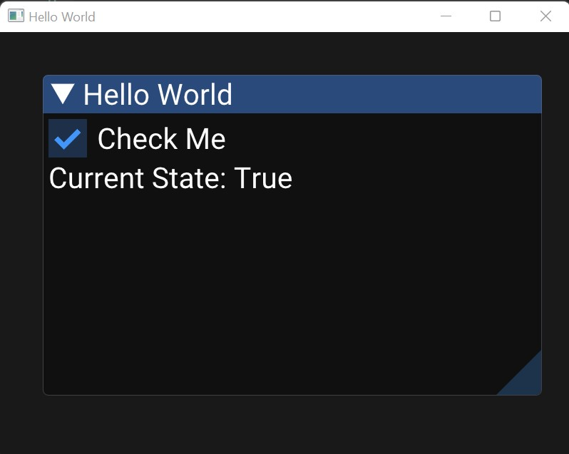

# Call Reference

On this page, you will find a list of all the functions and methods that are available in the library and details about them.

## Window(title, width, height, font)

[:octicons-tag-24: 1.0.2](https://github.com/hostedposted/py-gui/tree/1.0.2) - The window object.

| Parameter | Latest Change                                                                | Type                | Required         | Default Value    | Description                            |
| :-------- | ---------------------------------------------------------------------------- | :------------------ | :--------------- | :--------------- | :------------------------------------- |
| title     | [:octicons-tag-24: 1.0.2](https://github.com/hostedposted/py-gui/tree/1.0.2) | string              | :material-check: | :material-close: | This will be the window title.         |
| width     | [:octicons-tag-24: 1.0.2](https://github.com/hostedposted/py-gui/tree/1.0.2) | integer             | :material-close: | 800              | This will be the width of the window.  |
| height    | [:octicons-tag-24: 1.0.2](https://github.com/hostedposted/py-gui/tree/1.0.2) | integer             | :material-close: | 600              | This will be the height of the window. |
| font      | [:octicons-tag-24: 1.0.2](https://github.com/hostedposted/py-gui/tree/1.0.2) | file path (string)  | :material-close: | Roboto           | The font the window should use.        |
| theme     | [:octicons-tag-24: 1.2.0](https://github.com/hostedposted/py-gui/tree/1.2.0) | light, dark or auto | :material-close: | auto             | The theme of the window.               |


??? example

    ```py linenums="1" hl_lines="3"
    import pygui

    window = pygui.Window("Hello World", width=800, height=600, font="./Arial.ttf")
    ```

### Window.start()

[:octicons-tag-24: 1.0.2](https://github.com/hostedposted/py-gui/tree/1.0.2) - Start the window. This will make the window visible and wait for the user to close it. This will return when the user closes the window.

??? example

    ```py linenums="1" hl_lines="5"
    import pygui

    window = pygui.Window("Hello World")

    window.start()
    ```
    

### Window.frame(title, width, height)

[:octicons-tag-24: 1.0.2](https://github.com/hostedposted/py-gui/tree/1.0.2) - Add a frame to the window.

| Parameter | Latest Change                                                                | Type    | Required         | Default Value    | Description                      |
| :-------- | ---------------------------------------------------------------------------- | :------ | :--------------- | :--------------- | :------------------------------- |
| title     | [:octicons-tag-24: 1.0.2](https://github.com/hostedposted/py-gui/tree/1.0.2) | string  | :material-check: | :material-close: | This will be the frame's title.  |
| width     | [:octicons-tag-24: 1.0.2](https://github.com/hostedposted/py-gui/tree/1.0.2) | integer | :material-close: | Minimum Possible | This will be the frame's width.  |
| height    | [:octicons-tag-24: 1.0.2](https://github.com/hostedposted/py-gui/tree/1.0.2) | integer | :material-close: | Minimum Possible | This will be the frame's height. |

??? example

    ```py linenums="1" hl_lines="5 6 7"
    import pygui

    window = pygui.Window("Hello World")

    @window.frame("Hello World", width=700, height=450)
    def hello_world(elements: pygui.Elements):
        pass

    window.start()
    ```
    

!!! tip

    Although width and height are not required, they are recommended to be set. If they are not set, the frame will be as small as possible. Which will make it difficult to interact with the frame. A good way to find good widths and heights is to resize the frame to your liking. Then you can go into the ``imgui.ini`` file and see the width and height of the frame.

### Window.menu(category, title, keys)

[:octicons-tag-24: 1.0.2](https://github.com/hostedposted/py-gui/tree/1.0.2) - Add a menu button to the top of the window.

| Parameter | Latest Change                                                                | Type   | Required         | Default Value    | Description                                                                                                                 |
| :-------- | ---------------------------------------------------------------------------- | :----- | :--------------- | :--------------- | :-------------------------------------------------------------------------------------------------------------------------- |
| category  | [:octicons-tag-24: 1.0.2](https://github.com/hostedposted/py-gui/tree/1.0.2) | string | :material-check: | :material-close: | The button category to put this button under. If the category does not exist it will be added to the top bar of the screen. |
| title     | [:octicons-tag-24: 1.0.2](https://github.com/hostedposted/py-gui/tree/1.0.2) | string | :material-check: | :material-close: | The button to be added to the category.                                                                                     |
| keys      | [:octicons-tag-24: 1.0.2](https://github.com/hostedposted/py-gui/tree/1.0.2) | string | :material-close: | :material-close: | The keys that will be used to activate the button. Look below for usable keys.                                              |

Usable key names are:

- `Ctrl`
- `Shift`
- `Alt`
- Any key name from `A` to `Z`
- Any key name from `0` to `9`

??? example

    ```py linenums="1" hl_lines="9 10 11"
    import pygui

    window = pygui.Window("Hello World")

    @window.menu("File", "Quit", keys=["Ctrl", "Q"])
    def quit_program():
        exit(0)

    window.start()
    ```
    

## Elements(state)

[:octicons-tag-24: 1.0.2](https://github.com/hostedposted/py-gui/tree/1.0.2) - The elements object.

!!! warning

    **This should not be used directly.** When passing a function into the frame decorator, the function passed will get the elements object as the first argument.

### Elements.text(text, text_color, center, wrap_text)

[:octicons-tag-24: 1.0.2](https://github.com/hostedposted/py-gui/tree/1.0.2) - Add text to the frame.

| Parameter  | Latest Change                                                                | Type                                                             | Required         | Default Value    | Description                                |
| :--------- | ---------------------------------------------------------------------------- | :--------------------------------------------------------------- | :--------------- | :--------------- | :----------------------------------------- |
| text       | [:octicons-tag-24: 1.0.2](https://github.com/hostedposted/py-gui/tree/1.0.2) | string                                                           | :material-check: | :material-close: | This will be the text to be added.         |
| text_color | [:octicons-tag-24: 1.2.0](https://github.com/hostedposted/py-gui/tree/1.2.0) | HEX (int like 0xFF0000), RGB or RGBA (tuple like (255, 0, 0, 1)) | :material-close: | None (auto)      | The color of the text.                     |
| center     | [:octicons-tag-24: 1.0.2](https://github.com/hostedposted/py-gui/tree/1.0.2) | boolean                                                          | :material-close: | False            | Wether or not the text should be centered. |
| wrap_text  | [:octicons-tag-24: 1.0.2](https://github.com/hostedposted/py-gui/tree/1.0.2) | boolean                                                          | :material-close: | True             | Wether or not the text should be wrapped.  |
| font_size  | [:octicons-tag-24: 1.3.0](https://github.com/hostedposted/py-gui/tree/1.3.0) | float or integer                                                 | :material-close: | 48               | The font size of the text.                 |

!!! warning

    **Center and wrap cannot be used together (yet).** If both are enabled the text will not be centered.

!!! warning

    Font size uses the ``imgui.set_window_font_scale`` function to scale. This means that with big font sizes, the text will be a bit blurry.

??? example

    Let's add some text to the frame.

    ```py linenums="1" hl_lines="7"
    import pygui

    window = pygui.Window("Hello World")

    @window.frame("Hello World", width=700, height=450)
    def hello_world(elements: pygui.Elements):
        elements.text("Hello World!")

    window.start()
    ```
    

### Elements.button(text, text_color, wrap_text)

[:octicons-tag-24: 1.0.2](https://github.com/hostedposted/py-gui/tree/1.0.2) - Add a button to the frame.

| Parameter  | Latest Change                                                                | Type                                                             | Required         | Default Value    | Description                              |
| :--------- | ---------------------------------------------------------------------------- | :--------------------------------------------------------------- | :--------------- | :--------------- | :--------------------------------------- |
| text       | [:octicons-tag-24: 1.0.2](https://github.com/hostedposted/py-gui/tree/1.0.2) | string                                                           | :material-check: | :material-close: | This will be the text on the button.     |
| text_color | [:octicons-tag-24: 1.2.0](https://github.com/hostedposted/py-gui/tree/1.2.0) | HEX (int like 0xFF0000), RGB or RGBA (tuple like (255, 0, 0, 1)) | :material-close: | None (auto)      | The color of the text.                   |
| wrap_text  | [:octicons-tag-24: 1.0.2](https://github.com/hostedposted/py-gui/tree/1.0.2) | boolean                                                          | :material-close: | True             | Wether or not the text should be wrapped |

Returns a decorator. The function passed into the decorator will get called when the button is clicked.

??? example

    Let's add a button to the frame.

    ```py linenums="1" hl_lines="7 8 9"
    import pygui

    window = pygui.Window("Hello World")

    @window.frame("Hello World", width=700, height=450)
    def hello_world(elements: pygui.Elements):
        @elements.button("Hello World!")
        def hello_world_button():
            print("Hello World!")

    window.start()
    ```
    

    When you click the button ``Hello World!`` will be printed!

### Elements.button_event(key, time_limit)

[:octicons-tag-24: 1.1.0](https://github.com/hostedposted/py-gui/tree/1.1.0) - Add an element to the frame for `time_limit` seconds after a button is clicked.

| Parameter  | Latest Change                                                                | Type              | Required         | Default Value    | Description                                                                     |
| :--------- | ---------------------------------------------------------------------------- | :---------------- | :--------------- | :--------------- | :------------------------------------------------------------------------------ |
| key        | [:octicons-tag-24: 1.1.0](https://github.com/hostedposted/py-gui/tree/1.1.0) | string            | :material-check: | :material-close: | The button's key.                                                               |
| time_limit | [:octicons-tag-24: 1.1.0](https://github.com/hostedposted/py-gui/tree/1.1.0) | seconds (integer) | :material-check: | 10               | The amount of time the elements should be rendered after the button is pressed. |

Returns a decorator. The function passed into the decorator will get called constantly for `time_limit` seconds.

??? example

    Let's redo the button example with the `Hello World` text being rendered for 10 seconds after the button is clicked.

    ```py linenums="1" hl_lines="11 12 13"
    import pygui

    window = pygui.Window("Hello World")

    @window.frame("Hello World", width=700, height=450)
    def hello_world(elements: pygui.Elements):
        @elements.button("Hello World!", key="hello")
        def hello_world_button():
            pass

        @elements.button_event("hello", time_limit=10)
        def hello_world_button_event():
            elements.text("Hello World!")

    window.start()
    ```

    When you click the button ``Hello World!`` will be added to the frame for the next 10 seconds!


!!! warning

    Operations like opening files should **never** be done in the [`button_event`](#elementsbutton_eventkey-time_limit) function. This should be done in the [`button`](#elementsbuttontext-text_color-wrap_text) function.

### Elements.checkbox(label, default_value, key)

[:octicons-tag-24: 1.0.2](https://github.com/hostedposted/py-gui/tree/1.0.2) - Add a checkbox to the frame.

| Parameter     | Latest Change                                                                | Type           | Required         | Default Value    | Description                                                          |
| :------------ | ---------------------------------------------------------------------------- | :------------- | :--------------- | :--------------- | :------------------------------------------------------------------- |
| label         | [:octicons-tag-24: 1.0.2](https://github.com/hostedposted/py-gui/tree/1.0.2) | string         | :material-check: | :material-close: | This text will appear after the checkbox.                            |
| default_value | [:octicons-tag-24: 1.0.2](https://github.com/hostedposted/py-gui/tree/1.0.2) | boolean        | :material-check: | :material-close: | If the checkbox should be checked by default.                        |
| key           | [:octicons-tag-24: 1.0.2](https://github.com/hostedposted/py-gui/tree/1.0.2) | string or None | :material-close: | None             | What the value will be saved under in the [state](#elementsstate_1). |

Returns whether or not the checkbox is checked.

??? example

    Let's add a checkbox to the frame.

    ```py linenums="1"
    import pygui

    window = pygui.Window("Hello World")

    @window.frame("Hello World", width=700, height=450)
    def hello_world(elements: pygui.Elements):
        checked = elements.checkbox("Check Me", True)
        elements.text(f"Current State: {checked}")

    window.start()
    ```
    

### Elements.color_picker(label, default_value, alpha, key)

[:octicons-tag-24: 1.0.2](https://github.com/hostedposted/py-gui/tree/1.0.2) - Add a color picker to the frame.

| Parameter     | Latest Change                                                                | Type                                                             | Required         | Default Value    | Description                                                          |
| :------------ | ---------------------------------------------------------------------------- | :--------------------------------------------------------------- | :--------------- | :--------------- | :------------------------------------------------------------------- |
| label         | [:octicons-tag-24: 1.0.2](https://github.com/hostedposted/py-gui/tree/1.0.2) | string                                                           | :material-check: | :material-close: | This text will appear after the color picker.                        |
| default_value | [:octicons-tag-24: 1.0.2](https://github.com/hostedposted/py-gui/tree/1.0.2) | HEX (int like 0xFF0000), RGB or RGBA (tuple like (255, 0, 0, 1)) | :material-check: | :material-close: | The default color of the color picker.                               |
| alpha         | [:octicons-tag-24: 1.0.2](https://github.com/hostedposted/py-gui/tree/1.0.2) | boolean                                                          | :material-close: | False            | If a color is allowed to have an alpha value.                        |
| key           | [:octicons-tag-24: 1.0.2](https://github.com/hostedposted/py-gui/tree/1.0.2) | string or None                                                   | :material-close: | None             | What the value will be saved under in the [state](#elementsstate_1). |

Returns the color selected as an RGB or RGBA tuple.

??? example

    Let's add a color picker to the frame.

    ```py linenums="1" hl_lines="7 8"
    import pygui

    window = pygui.Window("Hello World")

    @window.frame("Hello World", width=700, height=450)
    def hello_world(elements: pygui.Elements):
        color = elements.color_picker("Pick a color", 0x008080)
        elements.text(f"You picked: {color}", text_color=color)

    window.start()
    ```
    

### Elements.input_int(label, default_value, minimum, maximum, key, wrap_text)

[:octicons-tag-24: 1.0.2](https://github.com/hostedposted/py-gui/tree/1.0.2) - Add an input to the frame that only accepts integers.

| Parameter     | Latest Change                                                                | Type           | Required         | Default Value     | Description                                                          |
| :------------ | ---------------------------------------------------------------------------- | :------------- | :--------------- | :---------------- | :------------------------------------------------------------------- |
| label         | [:octicons-tag-24: 1.0.2](https://github.com/hostedposted/py-gui/tree/1.0.2) | string         | :material-check: | :material-close:  | This text will appear after the input.                               |
| default_value | [:octicons-tag-24: 1.0.2](https://github.com/hostedposted/py-gui/tree/1.0.2) | integer        | :material-check: | 0                 | The default value of the input.                                      |
| minimum       | [:octicons-tag-24: 1.0.2](https://github.com/hostedposted/py-gui/tree/1.0.2) | integer        | :material-close: | negative infinity | The minimum value of the input.                                      |
| maximum       | [:octicons-tag-24: 1.0.2](https://github.com/hostedposted/py-gui/tree/1.0.2) | integer        | :material-close: | positive infinity | The maximum value of the input.                                      |
| key           | [:octicons-tag-24: 1.0.2](https://github.com/hostedposted/py-gui/tree/1.0.2) | string or None | :material-close: | None              | What the value will be saved under in the [state](#elementsstate_1). |
| wrap_text     | [:octicons-tag-24: 1.0.2](https://github.com/hostedposted/py-gui/tree/1.0.2) | boolean        | :material-close: | True              | Wether or not the text should be wrapped.                            |

??? example

    Let's add an input to the frame.

    ```py
    import pygui

    window = pygui.Window("Hello World")

    @window.frame("Hello World", width=700, height=450)
    def hello_world(elements: pygui.Elements):
        value = elements.input_int("What is your favorite number?", 7)
        elements.text(f"You picked: {value}")

    window.start()
    ```
    


### Elements.input_text(label, default_value, key, wrap_text, max_length)

[:octicons-tag-24: 1.0.2](https://github.com/hostedposted/py-gui/tree/1.0.2) - Add an input to the frame.

| Parameter     | Latest Change                                                                | Type           | Required         | Default Value    | Description                                                          |
| :------------ | ---------------------------------------------------------------------------- | :------------- | :--------------- | :--------------- | :------------------------------------------------------------------- |
| label         | [:octicons-tag-24: 1.0.2](https://github.com/hostedposted/py-gui/tree/1.0.2) | string         | :material-check: | :material-close: | This text will appear after the input.                               |
| default_value | [:octicons-tag-24: 1.0.2](https://github.com/hostedposted/py-gui/tree/1.0.2) | string         | :material-check: | empty string     | The default value of the input.                                      |
| key           | [:octicons-tag-24: 1.0.2](https://github.com/hostedposted/py-gui/tree/1.0.2) | string or None | :material-close: | None             | What the value will be saved under in the [state](#elementsstate_1). |
| wrap_text     | [:octicons-tag-24: 1.0.2](https://github.com/hostedposted/py-gui/tree/1.0.2) | boolean        | :material-close: | True             | Wether or not the text should be wrapped.                            |
| max_length    | [:octicons-tag-24: 1.0.2](https://github.com/hostedposted/py-gui/tree/1.0.2) | integer        | :material-close: | 255              | The maximum amount of characters that can be in the input.           |

??? example

    Let's add an input to the frame.

    ```py
    import pygui

    window = pygui.Window("Hello World")

    @window.frame("Hello World", width=700, height=450)
    def hello_world(elements: pygui.Elements):
        value = elements.input_text("Enter text", "Hello World!")
        elements.text(f"You picked: {value}")

    window.start()
    ```
    

### Elements.state

[:octicons-tag-24: 1.0.2](https://github.com/hostedposted/py-gui/tree/1.0.2) - This element stores the values of some objects.

- You can use the `state` for getting the value of objects before their definition.

```py linenums="1" hl_lines="7"
import pygui

window = pygui.Window("Hello World")

@window.frame("Hello World", width=700, height=450)
def hello_world(elements: pygui.Elements):
    elements.text(f"You picked: {elements.state.get("favorite")}")
    value = elements.input_int("What is your favorite number?", 7, key="favorite")

window.start()
```

- You can use the `state` for setting an object's state.

```py linenums="1" hl_lines="8 9 10"
import pygui

window = pygui.Window("Hello World")

@window.frame("Hello World", width=700, height=450)
def hello_world(elements: pygui.Elements):
    value = elements.input_int("What is your favorite number?", 7, key="favorite")
    @elements.button("Add 2")
    def add_2():
        elements.state["favorite"] += 2

window.start()
```
