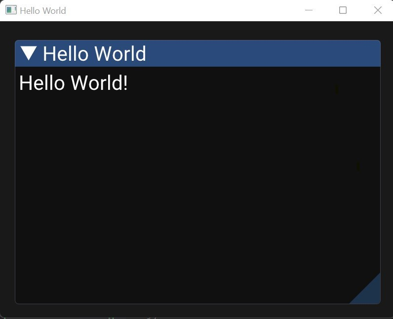

# Home

PyGUI is an easy-to-use GUI library for Python.

Install it using `pip install py-gui-tool`.

In less than 10 lines you can easily make a GUI:

```py linenums="1"
import pygui

window = pygui.Window("Hello World") # (1)!

@window.frame("Hello World", width=700, height=450) # (2)!
def hello_world(elements: pygui.Elements):
    elements.text("Hello World!") # (3)!

window.start() # (4)!
```

1. Initialize the window with the name ``Hello World``.
2. Create a frame with the name ``Hello World``.
3. Add the text ``Hello World!`` to the frame.
4. Make the window visible.


